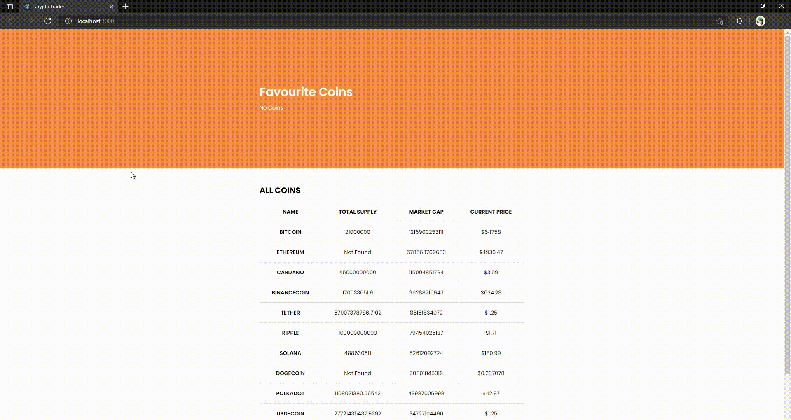

# Crypto Tracker

## Key Features and Concepts

-   React JS
-   Local Storage
-   Unit Testing (Using Jest, Enzyme, React Testing Library)
-   API Calls/Data Fetching
-   Hooks (useState & useEffect)
-   Props (Including lifting state from children to parent and across several components)
-   Sass

## Video Demo

## Feature Breakdown

### Favourites (Top)

When favourite added in lower section coin will appear. Coins are saved to **local storage** and will priest through a page refresh. To remove coin click on coin. Animation on hover.

### All Coins (Middle)

API calls in 10 coins initially sorting into an HTML table. Options to call 10 more up to 100 or 100 at once. Clicking on a coin will bring up information and a form to trade.

### Coin Information (Bottom Left)

Selected coin from All Coins section will appear. Displays detailed information and the ability to add the coin to favourites.

### Trade Form (Bottom Right)

Form allows you to trade selected coin from All Coins section with available currencies.
